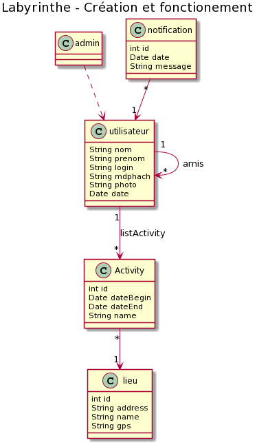

# Project_Jee

## Prerequisite

- MySQL server
- JEE
- Tomcat

## Project setup with IDEA (ultimate)

1. clone the repo.
2. open the repo with IDEA.
3. add a new "TomCat local" configuration.
4. in the "Startup/Connection" tab, create 2 new environment variables:
   - USERNAME: your sql server username
   - PASSWORD: your sql server password
5. create the database "projetweb" and execute the create.sql file to create all the tables.

## UML

